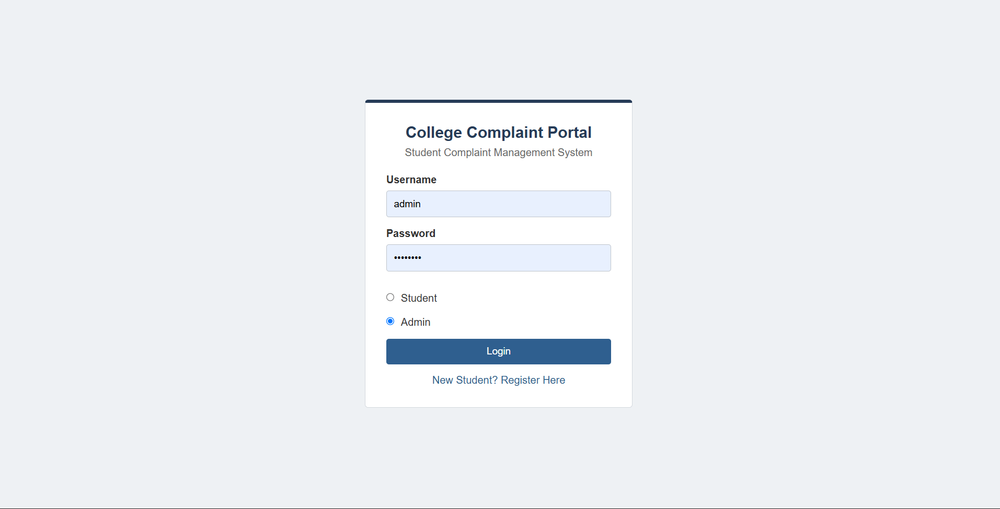
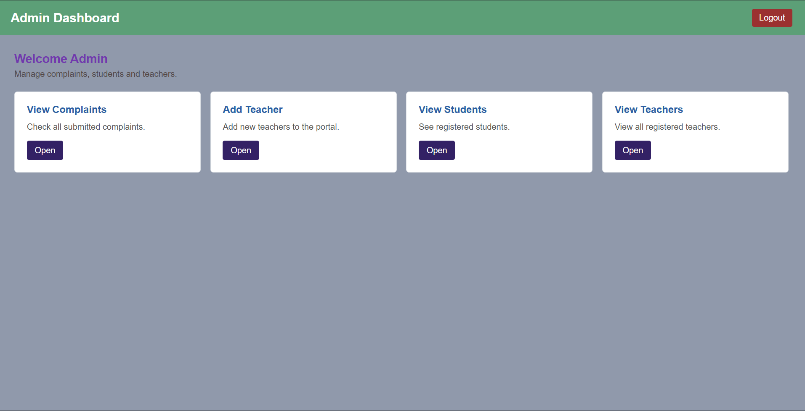

College Complaint Portal

A web-based complaint management system that gives students a simple way to submit college complaints and allows administrators to review and respond to them.

"College Complaint Portal" 

Try it

Live Demo: https://complaint-portal-txh4.onrender.com

Open the link and use the portal directly in your browser.

Quick Start

For the deployed version, there is nothing to install.

Open: https://complaint-portal-txh4.onrender.com

For testing the admin side:

Username: admin
Password: admin123

Features

- Student registration and login
- Students can submit complaints and suggestions
- Complaints can be categorized as Faculty, College, Suggestion, or Other
- Students can view their complaint history
- Administrators can add, edit, view, and delete teacher records
- Teachers and administrators can review complaints
- Complaints can be replied to
- PostgreSQL database for storing application data
- Responsive web interface
- Deployed and accessible online through Render

How It Works

The portal separates the application into different roles.

Students use the portal to submit complaints and check their previous submissions. administrators have additional management features for students, teachers, and complaints.

The application is built with Django, which handles the application logic, database operations, URLs, and authentication flow.

For production, the application uses PostgreSQL instead of the local development database. The database connection is provided through the "DATABASE_URL" environment variable.

Static files are collected during deployment and served using WhiteNoise.

The application is hosted on Render using Gunicorn.

Tech Stack

- Python
- Django
- PostgreSQL
- HTML
- CSS
- Gunicorn
- WhiteNoise
- Render

Run Locally

Requirements

- Python 3
- pip
- Git

Clone the project

git clone https://github.com/pip-DRGN0/demo.git
cd demo

Create a virtual environment

python -m venv .venv

On Windows:

.venv\Scripts\activate

Install dependencies

pip install -r requirements.txt

Run migrations

python manage.py migrate

Start the server

python manage.py runserver

Open:

http://127.0.0.1:8000/

Deployment

The project is deployed using Render.

Build Command

pip install -r requirements.txt && python manage.py collectstatic --noinput && python manage.py migrate

Start Command

gunicorn djangoproject.wsgi:application

The production database is connected using:

DATABASE_URL

Other production environment variables include:

SECRET_KEY
DEBUG
ALLOWED_HOSTS

Sensitive values should not be stored directly in the repository.

Database

The application uses Django models for managing:

- Login accounts
- Students
- Teachers
- Complaints

Django migrations create and update the required database tables during deployment.

Complaint Categories

Currently supported categories are:

- Faculty
- College
- Suggestion
- Other

Future Improvements

Some things I would like to improve later:

- Complaint status tracking
- Email notifications
- Better search and filtering
- File and image attachments
- A more detailed admin dashboard
- Stronger password security
- More detailed role-based permissions
- Better mobile supporting

Developed by Karthik Sudhakaran.

